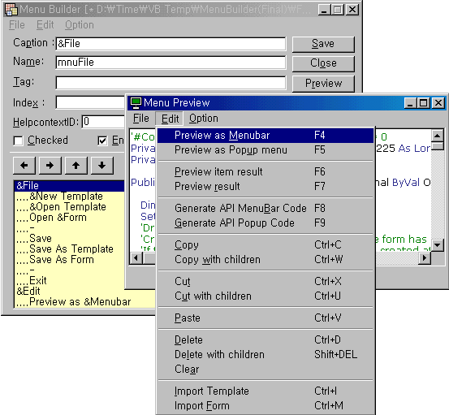



## Menu Builder \(featuring runtime preview\)

### Description

Menu builder is featuring file drag & drop,

smooth listBox item dragging for parent and child node,

clipboard copy and paste operation using cutsom clipboard format, and

previewing menu as a menubar or popup menu in real tme.

And, also generates API created menu code for the given VB menu.

Above of all, internally, it parses the tree structure of VB menu text correctly,

with resuable pasring class modules. I think they can be used for other purposes and projects.

Please, try and enjoy my project and also vote for me.
 
### More Info
 

             |
---                |---
**Submitted On**   |2003-06-14 00:51:40
**By**             |[S\.Y\. Kim](https://github.com/Planet-Source-Code/PSCIndex/blob/master/ByAuthor/s-y-kim.md)
**Level**          |Advanced
**User Rating**    |4.7 (33 globes from 7 users)
**Compatibility**  |VB 5\.0, VB 6\.0
**Category**       |[Complete Applications](https://github.com/Planet-Source-Code/PSCIndex/blob/master/ByCategory/complete-applications__1-27.md)
**World**          |[Visual Basic](https://github.com/Planet-Source-Code/PSCIndex/blob/master/ByWorld/visual-basic.md)
**Archive File**   |[Menu\_Build1600866142003\.zip](https://github.com/Planet-Source-Code/s-y-kim-menu-builder-featuring-runtime-preview__1-46175/archive/master.zip)

